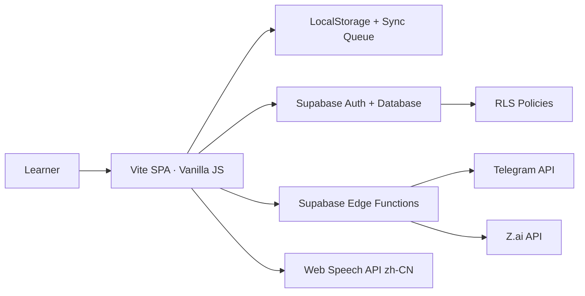

# Panda Lingua — Full Product & UI/UX Blueprint

> **Vai trò:** Tài liệu canonical để Product, Design, Dev và QA cùng triển khai.  
> **Phiên bản:** 1.0 — 2026-09-14  
> **Nguồn:** AG4C v2 Buổi 1–7, barem Final Project, code hiện hành, Personal AI Language Coach.  
> **Nhãn:** `[FACT]` xác minh từ code/tài liệu; `[RECOMMENDATION]` đề xuất chưa triển khai.

## 1. Kết luận điều hành

Panda Lingua nên phát triển thành **ứng dụng học từ vựng tiếng Trung cá nhân hóa, mobile-first, offline-first**, giúp người mới hoàn thành chu trình 10–15 phút:

`Biết việc cần làm → Học từ → Kiểm tra → Ôn đúng lúc → Thấy tiến bộ`.

Core loop SRS là trục chính; AI Coach, Telegram và thư viện từ là lớp tăng giá trị.

### North Star

**Số phiên Daily Learning Loop hoàn thành mỗi tuần trên mỗi learner.**

### Guardrails

1. Vào học không quá 2 thao tác từ Home.
2. Guest không bị ép đăng nhập trước khi trải nghiệm.
3. Một vùng quyết định chỉ có một primary CTA.
4. Không dùng AI thay thế dữ liệu chuẩn HSK hoặc thuật toán SRS.
5. Không trộn dữ liệu giữa người dùng; không lộ secret ở frontend.
6. Không tạo cảm giác tội lỗi khi learner bỏ streak.

## 2. Đối tượng và Jobs-to-be-Done

### Persona A — Người mới hoàn toàn

- 15–35 tuổi; chưa quen chữ Hán và thanh điệu.
- Học 10–15 phút/ngày bằng điện thoại.
- Cần Pinyin và nghĩa Việt trước; Hán tự tăng dần.
- JTBD: “Tôi muốn biết chính xác hôm nay học gì và được nhắc ôn đúng lúc để không bỏ cuộc vì quá tải.”

### Persona B — Người luyện HSK 1–2

- Đã biết một phần từ cơ bản; cần quiz, SRS, thống kê và nhận diện lỗ hổng.
- JTBD: “Tôi muốn ưu tiên từ hay quên và đo tiến bộ thật để dùng thời gian hiệu quả.”

### Persona C — Người đi làm bận rộn

- Học theo phiên ngắn, hay gián đoạn; cần tiếp tục đúng vị trí, offline và nhắc lịch nhẹ nhàng.

## 3. Phạm vi

### P0 — Bắt buộc

Guest mode, onboarding, daily goal, Home, Learn, Quiz, SRS Review, Stats, audio `zh-CN`, responsive, form/validation, UI states, Supabase read/write, Auth, RLS, URL production, docs và demo.

### P1 — Nâng cao

Guest→Account migration, Vocabulary Library, offline sync queue, Telegram, accessibility AA, analytics funnel.

### P2 — Mở rộng

Pinyin-first ramp, AI Panda Coach, reminder scheduler, weekly recap, speaking/pronunciation từ Language Coach.

### Ngoài scope đầu tiên

HSK 3–6, payment, social feed, leaderboard toàn cầu, voice call realtime, PvP.

## 4. Kiến trúc

### Hiện trạng xác minh

- `[FACT]` Vite + Vanilla JS ES Modules; 5 màn hình và service SRS/storage/TTS/Supabase.
- `[FACT]` Storage merge cloud lên local và fire-and-forget cloud writes.
- `[FACT]` `userId` là ID guest tự sinh, chưa phải Supabase Auth user.
- `[FACT]` Tailwind CDN/Google Fonts trong `index.html`; demo data seed ở LocalStorage.

### Kiến trúc đích

- `AppShell`: route, global/auth/online/sync state.
- Feature modules: home, learn, quiz, review, stats, library, profile/settings.
- Domain services: SRS, session, streak, quiz, curriculum.
- Infrastructure: repository, Supabase adapter, sync engine, Edge Function client.
- Component không gọi database trực tiếp.

## 5. Information Architecture

| Vị trí | Mobile | Desktop | Chức năng |
|---|---|---|---|
| 1 | Hôm nay | Hôm nay | Daily plan và CTA |
| 2 | Học | Học từ mới | Learning session |
| 3 | Ôn tập | Ôn tập SRS | Due queue |
| 4 | Tiến độ | Tiến độ | Stats/insight |
| 5 | Cá nhân | Thư viện + Cá nhân | Profile/settings/library |

Quiz là bước trong session. Auth là modal/page theo trạng thái. AI Coach là contextual action.

## 6. Hành trình

### First-run

Splash ≤800ms → value proposition → chọn goal/level → chọn 5/10/20 từ → Pinyin-first → Guest mode → sau phiên đầu mới mời tạo account.

### Daily loop

Home daily card → Learn (nghe/Pinyin/nghĩa/Hanzi) → Quiz → Review due/sai → Completion → sync/queue → optional Telegram.

## 7. Đặc tả chức năng

### F01 — Onboarding & Daily Goal

- Trigger: first launch hoặc thiết lập lại.
- Input: goal, level, target, pinyinFirst, reminder.
- Validation: 5–30 từ; reminder time khi bật.
- States: progress, inline error, loading, retry.
- Acceptance: keyboard-complete, back không mất input, ≤90 giây.

### F02 — Auth & Guest Upgrade

Email/password sign-up/sign-in/sign-out/forgot password; preview dữ liệu merge; password ≥8; chỉ báo sync thành công khi server xác nhận; account A không đọc account B.

### F03 — Home / Today

Greeting; daily plan gồm new/due/time; quick stats; HSK progress; lý do chọn từ; sync indicator; complete empty state + luyện tự chọn.

### F04 — Learn

Hanzi, Pinyin, nghĩa, example, audio; Pinyin-first reveal; replay/slow/previous/continue/mark hard; Space phát audio; chỉ ghi item khi hoàn thành; audio fallback.

### F05 — Quiz

Hanzi/Pinyin/audio→meaning; 4 distractors không trùng nghĩa; lock sau submit; giải thích + replay; accuracy theo answered; persist khi complete/exit.

### F06 — SRS Review

Queue `status != new && nextReviewAt <= now`; phải reveal trước rating; Hard/Good/Easy hiển thị lịch tiếp; Hard trở lại cuối queue tối đa 1 lần/phiên; unit test timezone/boundary.

### F07 — Stats

Today/7/30 days; learned/mastered/due/retention proxy/accuracy/streak; chart có text alternative; không dùng số demo cho account mới; insight gắn CTA.

### F08 — Library

Search Hanzi/Pinyin/Việt không dấu; filter HSK/status/category; mastery/next review/audio; learn again/mark hard/AI; empty filter có clear.

### F09 — Profile & Settings

Goal/level/target; Pinyin-first/Hanzi/audio/speed; Telegram/reminder; export JSON/CSV/reset/delete; destructive confirmation cụ thể.

### F10 — AI Panda Coach

Contextual theo từ; input vocabId/level/goal; output JSON `mnemonic`, `radicalHint`, `example`, `pronunciationTip`; cache theo prompt version; timeout 12s/retry 1/fallback; nhãn AI; không ghi đè dataset.

### F11 — Telegram

Opt-in và test message; completion/streak/reminder; Edge Function validate JWT/schema/rate limit; delivery log; lỗi Telegram không block learning completion.

### F12 — Feedback

Category, message 20–1000 ký tự, contact permission; inline validation, receipt ID; không gửi PII/local data ngoài consent.

## 8. Business Rules

### Daily plan

- Due ưu tiên trước new; learner vẫn được chọn.
- `estimatedMinutes = ceil((new*25 + due*12 + quiz*15)/60)`.
- Không vượt target nếu learner không chủ động.

### SRS baseline

- Hard: rep=0, interval=0, EF=max(1.3, EF−0.2).
- Good: rep+1; interval 1, 3, rồi round(interval×EF).
- Easy: rep+1; interval 3, 6, rồi max(3, round(interval×EF×1.3)).
- Mastered tại repetition ≥3; timestamps UTC, learning day theo profile timezone.

### Streak

Ngày hợp lệ khi hoàn thành 1 session hoặc 5 review; same-day không cộng; nghỉ một ngày reset 0; chưa dùng streak freeze.

### Sync

Mutation có operation/entity/update/device ID; server wins profile/security, latest valid wins progress; demo seed không ghi đè cloud; retry 2s/5s/15s rồi manual retry.

## 9. Analytics

| Event | Khi phát | Thuộc tính |
|---|---|---|
| `onboarding_completed` | Hoàn tất | level, goal, target |
| `daily_session_started` | Bấm CTA | new, due, mode |
| `word_learned` | Xong card | vocabId, playCount, pinyinFirst |
| `quiz_answered` | Chốt đáp án | vocabId, correct, latencyMs |
| `srs_rated` | Rating | vocabId, rating, interval |
| `session_completed` | Completion | duration, accuracy, count |
| `sync_failed` | Lỗi sync | type, errorClass, retry |
| `ai_hint_requested` | Gọi AI | vocabId, cacheHit, latency |

Không gửi email, transcript, token vào analytics.

## 10. Non-functional

- LCP ≤2.5s mobile 4G; feedback ≤100ms.
- Lighthouse Performance ≥90, Accessibility/Best Practices ≥95.
- WCAG 2.2 AA; contrast 4.5:1, focus, target ≥44px.
- Offline với dataset/progress; không crash nếu TTS/Supabase unavailable.
- Không log secret, auth token, PII.

## 11. Milestones

M1 UX Foundation → M2 Cloud Identity → M3 Learning Reliability → M4 Integrations → M5 Production & Demo.

## 12. Definition of Done

F01–F12 đủ states/acceptance; responsive 375/768/1024/1440; guest/account không mất dữ liệu; RLS A/B PASS; offline sync không duplicate; secrets server-only; AG4C mapping 100%; production mở từ máy khác.
