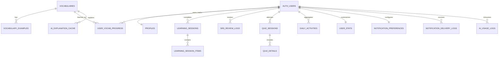

# Panda Lingua — Technical Architecture & Data Specification

## 1. Quyết định kiến trúc

- Giữ Vite + Vanilla JS ES Modules; refactor theo module nhỏ, không rewrite framework.
- Offline-first repository: local commit trước; cloud acknowledgement sau.
- Supabase Auth ID là canonical `user_id` cho account; guest ID chỉ ở local.
- Tất cả secret-bearing integration qua Edge Functions.
- Migration nhỏ, versioned, reversible; không chạy destructive SQL không backup.

## 2. Module Map

```text
src/
  app/            app-shell, router, global-state
  features/       onboarding, auth, home, learn, quiz, review, stats, library, settings
  components/     reusable UI primitives
  domain/         srs, streak, daily-plan, quiz rules
  repositories/   learning-repository, profile-repository
  services/       supabase, local-store, sync-engine, tts, analytics, edge-functions
  data/           bundled HSK fallback dataset
```

## 3. Data Model



### Canonical entities

- `profiles(id uuid PK/FK auth.users, display_name, goal, level, daily_target, pinyin_first, timezone, created_at, updated_at)`.
- `vocabularies`: giữ schema hiện tại; thêm `source`, `version`, `is_active`.
- `user_vocab_progress`: đổi `user_id` sang UUID; thêm `version`, `updated_at`, `last_operation_id`.
- `learning_sessions(id uuid, user_id, mode, status, started_at, completed_at, duration_seconds, new_count, review_count, accuracy, device_id)`.
- `learning_session_items(session_id, vocab_id, stage, result, position, completed_at)`.
- `sync_operations(operation_id uuid, user_id, device_id, entity_type, entity_id, operation_type, status, attempts, payload_hash, created_at, acknowledged_at)`.
- Notification/AI logs không lưu secret hoặc full auth token.

## 4. RLS Matrix

| Table | SELECT | INSERT | UPDATE | DELETE |
|---|---|---|---|---|
| vocabularies/examples | authenticated/anon read active | service role | service role | service role |
| profiles | own row | own ID | own row | own row/controlled function |
| progress/sessions/reviews/quiz/stats | own rows | own rows | own rows | own rows |
| notification preferences | own | own | own | own |
| delivery/AI usage logs | own read | Edge Function/service | service | service |
| AI cache | authenticated read | Edge Function/service | service | service |

Policy pattern:

```sql
USING (auth.uid() = user_id)
WITH CHECK (auth.uid() = user_id)
```

Không dùng `user_id TEXT` do client tự sinh cho bảng cloud cá nhân sau migration.

## 5. Guest Migration

1. Export/validate local snapshot; reject malformed records.
2. Auth user established.
3. Generate migration ID and payload hash.
4. Fetch cloud snapshot.
5. Preview counts/conflicts.
6. Upsert in transaction-like batches with operation IDs.
7. Verify counts/checksums.
8. Mark local snapshot linked; không xóa local ngay.
9. Sau 7 ngày/explicit user action mới cleanup backup.

Conflict: profile uses explicit choice/server; progress uses newest valid `lastReviewedAt`, tie chọn repetition/totalReviews cao hơn; never merge demo seed.

## 6. Sync Engine Contract

- `enqueue(entityType, entityId, operationType, payload)`.
- `flush()` chỉ khi online + authenticated.
- Mỗi operation idempotent theo `operation_id`.
- Retry 2s, 5s, 15s; max 3 tự động.
- UI states: local-only, queued, syncing, synced, needs-attention.
- Không sử dụng blind `{...local, ...cloud}` merge như đích production.

## 7. Edge Functions

### `notify-telegram`

**Request:** `{eventType, sessionId, locale}` + Bearer JWT.  
**Server:** verify user; fetch session/profile/preferences; construct message; call Telegram; write delivery log.  
**Response:** `{deliveryId, status}`.  
**Errors:** 400 schema, 401 auth, 403 preference/ownership, 429 limit, 502 Telegram.  
**Limits:** 5 completion messages/user/day; idempotency by `eventType+sessionId`.

### `generate-mnemonic`

**Request:** `{vocabId, learnerLevel, goal, promptVersion}`.  
**Server:** verify JWT, fetch canonical word, cache lookup, enforce daily quota, call Z.ai, schema validate, cache safe result.  
**Response:** `{source:'cache'|'ai', mnemonic, radicalHint, example, pronunciationTip}`.  
**Limits:** 20 calls/user/day; timeout 12s; max 1 retry.

### `daily-review-reminder` — optional

Scheduled job queries opt-in users by timezone and due count; inserts delivery idempotency key before send.

## 8. Security

- Frontend only anon/publishable key; service role/Z.ai/Telegram keys server-side.
- Remove in-app custom Supabase key modal from production build; it risks configuration leakage and user confusion.
- CSP restrict script/connect origins; replace Tailwind CDN with build-time CSS before production.
- Validate all Edge Function inputs with schema; sanitize Telegram HTML.
- Redact sensitive data from logs; rotate leaked credentials.
- Dependency audit before deploy.

## 9. Reliability

- Local writes must be caught and quota errors surfaced.
- Database mutation returns structured result, not silent `console.warn` only.
- Session completion independent of Telegram/AI.
- Database indexes: `(user_id,next_review_at)`, `(user_id,activity_date)`, `(user_id,updated_at)`.
- Backups before schema change; rollback SQL for each migration.

## 10. Observability

- Client: error class, route, operation ID, no PII.
- Edge: request ID, user hash, latency, provider response class.
- Dashboard: sync failure rate, auth error rate, AI latency/quota, Telegram delivery success.
- Alert thresholds: sync failure >5%/15m, Edge 5xx >3%/15m.

## 11. Testing

- Unit: SRS boundaries, streak/timezone, quiz distractors, merge/conflict.
- Integration: local repository, Supabase adapter, queue retry/idempotency.
- Security: two-user RLS tests for every operation.
- E2E: guest loop; account signup/login; migration; offline→online; Telegram; AI fallback.
- Performance/accessibility: Lighthouse and keyboard flows.

## 12. Deployment

1. Dev/local Supabase project.
2. Staging project + preview deployment.
3. Run migrations + seed canonical vocab.
4. Security test and smoke test.
5. Production deployment with environment secrets.
6. Verify from unrelated device/browser.
7. Rollback path: previous static deployment + backward-compatible DB.
