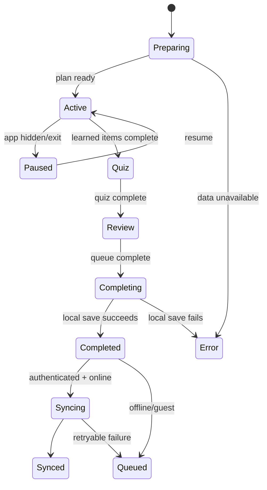
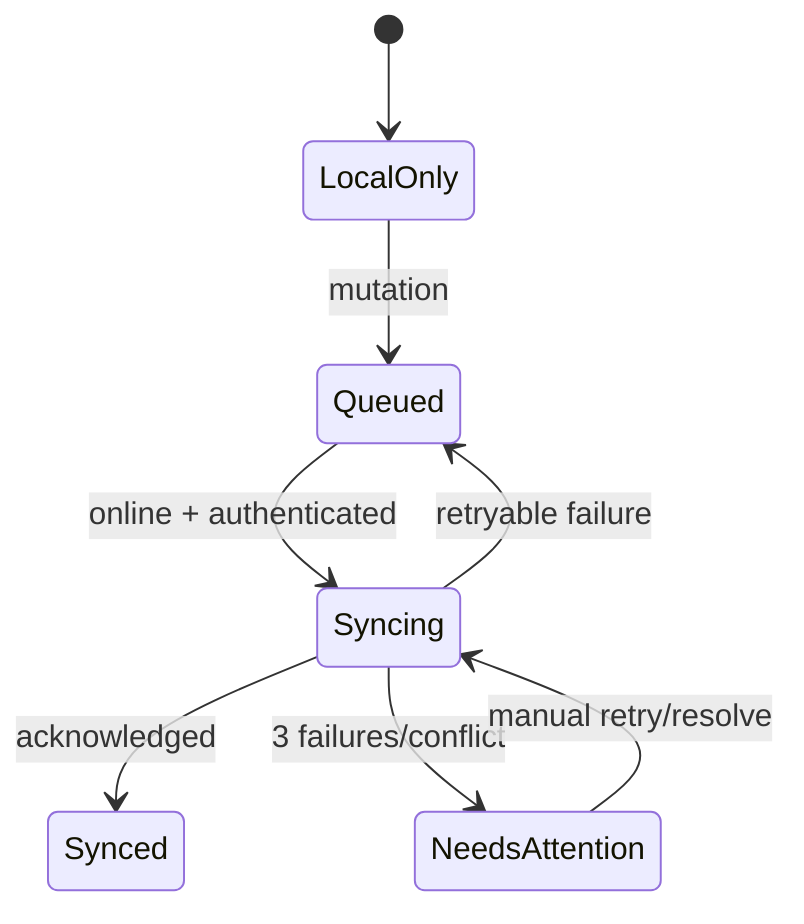

# Panda Lingua — UX Flow & State Specification

## 1. Nguyên tắc UX

1. Value before account: trải nghiệm trước, đăng nhập sau.
2. Recognition over recall: luôn cho biết vị trí, tiến độ, hành động tiếp.
3. Error recovery over blame: lỗi phải có cách khôi phục.
4. Progressive disclosure: người mới thấy Pinyin/audio trước, chi tiết sau.
5. Honest feedback: phân biệt lưu local, queued và synced.

## 2. State Machines

### Learning session

### Sync

## 3. Flow Contracts

### UX01 First-run onboarding

- Entry: no `onboarding_completed_at`.
- Step 1 Goal; Step 2 Level; Step 3 Daily target; Step 4 Learning preference.
- Save mỗi bước local để browser reload không mất input.
- Skip chỉ cho reminder; goal/level/target bắt buộc.
- Exit: Home với daily plan phù hợp.

### UX02 Guest → Account

1. Trigger sau session đầu hoặc Settings.
2. Nêu lợi ích: giữ tiến độ trên nhiều thiết bị.
3. Auth thành công → đọc cloud snapshot.
4. Hiện merge preview: local words, cloud words, conflicts.
5. Xác nhận merge → idempotent migration.
6. Success hiển thị thời gian sync; failure giữ nguyên local.

### UX03 Daily learning

- Home CTA cụ thể theo workload.
- Learn có Save & Exit.
- Quiz không cho double-submit.
- Review không cho rating trước reveal.
- Completion luôn được lưu local trước call ngoài.

### UX04 Offline recovery

- Banner “Đang học ngoại tuyến — tiến độ được lưu trên thiết bị này.”
- Không disable core learning.
- Khi online: silent retry; chỉ báo thành công sau acknowledgement.
- Sau 3 lỗi: inline alert + “Thử đồng bộ lại”.

### UX05 AI hint

Tap contextual action → skeleton in-place → result sections → copy/replay → feedback useful/not useful. Timeout giữ card và CTA retry; không blank modal.

## 4. State Catalog

| Context | Loading | Empty | Error | Success |
|---|---|---|---|---|
| Home | Skeleton plan/stats | First-day plan | Local fallback + retry cloud | Updated timestamp |
| Learn | Fixed-height card skeleton | Hết new words | Audio/data fallback | Card progress update |
| Quiz | Question skeleton | Không đủ items | Rebuild quiz/return learn | Correct/incorrect panel |
| Review | Card skeleton | Hết due + next due time | Local queue fallback | Rating + next interval |
| Stats | KPI/chart skeleton | Chưa có activity | Retry + cached stats | Period refreshed |
| Library | List skeleton | No result + clear filters | Retry data load | Result count |
| Auth | Button spinner | N/A | Inline field/global | Verify email/signed in |
| Sync | Subtle spinner | No pending items | Needs attention | Synced time |
| AI | In-card skeleton | No cached hint | Retry/fallback | Structured hint |

## 5. Microcopy Canonical

### Home

- CTA: **“Bắt đầu phiên 10 phút”**.
- Complete: **“Hôm nay bạn đã hoàn thành kế hoạch.”**
- Secondary: **“Luyện thêm 5 từ”**.

### Validation

- Email: “Nhập email đúng định dạng, ví dụ ten@domain.com.”
- Password: “Mật khẩu cần ít nhất 8 ký tự.”
- Feedback: “Mô tả thêm một chút để Panda hiểu vấn đề (ít nhất 20 ký tự).”

### Offline/sync

- Offline: “Đang học ngoại tuyến. Tiến độ vẫn được lưu trên thiết bị này.”
- Queued: “Đã lưu trên máy, chờ đồng bộ.”
- Synced: “Đã đồng bộ lúc {time}.”
- Failed: “Chưa thể đồng bộ. Dữ liệu trên máy vẫn an toàn.” CTA “Thử lại”.

### Audio

- No voice: “Thiết bị chưa có giọng Trung phù hợp. Bạn vẫn có thể xem Pinyin.”
- Permission/problem: “Chưa phát được âm thanh.” CTA “Thử giọng khác”.

### Completion

- “Bạn vừa hoàn thành {count} từ trong {minutes} phút.”
- “{weakCount} từ cần gặp lại sớm — Panda đã xếp lịch ôn.”
- Không dùng câu shame khi accuracy thấp.

## 6. Edge Cases

1. Reload giữa session: resume từ item cuối đã committed.
2. Hai tab: khóa session bằng session ID; tab sau read-only hoặc takeover có warning.
3. Clock/timezone đổi: server timestamps UTC; recompute display only.
4. Dataset item thiếu example: ẩn section, không render “undefined”.
5. Duplicate answer meaning: loại distractor hoặc chuyển question type.
6. Speech API absent: audio button disabled kèm giải thích.
7. Auth expires: lưu local/queue; yêu cầu đăng nhập lại không mất flow.
8. RLS denial: không fallback bằng cách mở policy; log class và hướng dẫn.
9. Telegram/AI lỗi: không rollback learning completion.
10. Reset data offline: confirmation + export offer; xóa queue liên quan.

## 7. Usability Acceptance

- Người mới xác định CTA chính trong ≤5 giây.
- Core loop không có dead end.
- Back/refresh không mất confirmed progress.
- Mỗi error có ít nhất một recovery path.
- Không có màn hình chỉ truyền đạt trạng thái bằng màu.
- Keyboard-only hoàn thành được onboarding, learn, quiz, review.
